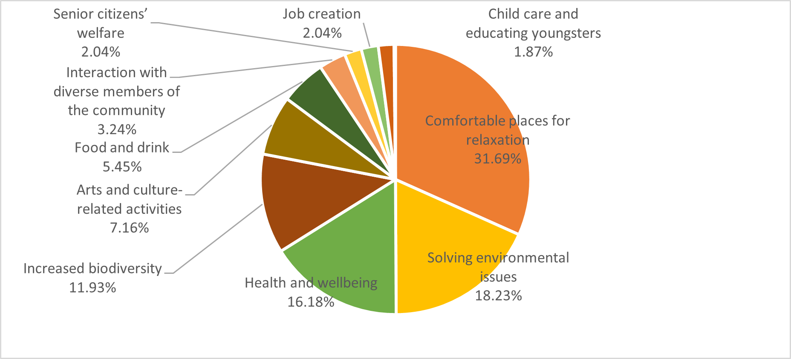
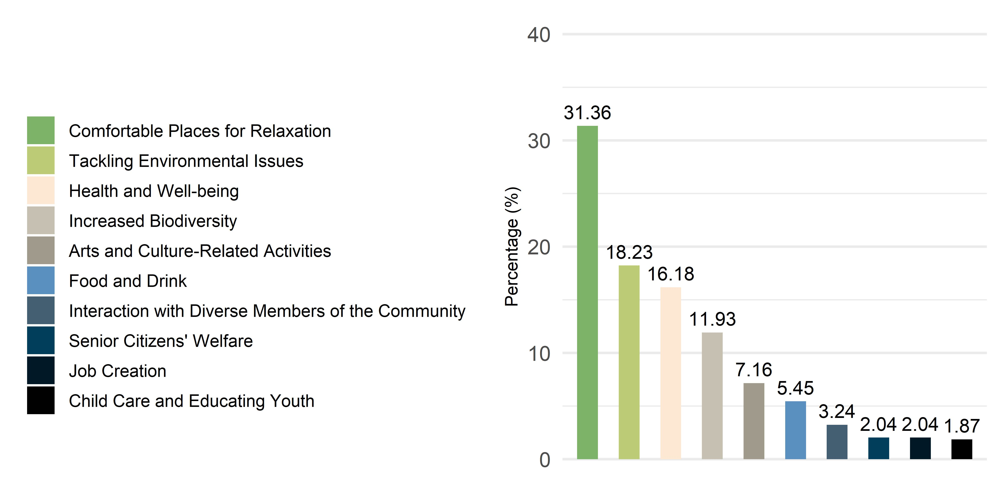
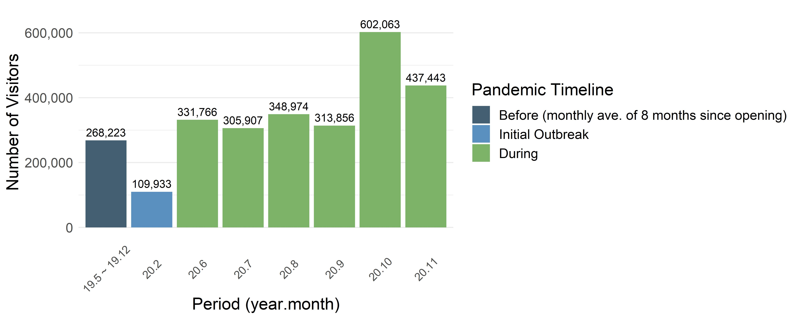

## README

Repository for data visualizations created for UNDP publication, 'SDG Policy Brief Series No. 12. Using Urban Green Spaces in the Pandemic: Example from the Republic of Korea' during internship period (Sept. '21 ~ Feb '22) with the resilience team at the UNDP Seoul Policy Centre.

As part of the editing team for the publication, I created data visualizations using R to create a cohesive design and improve the publication's visual impact.

Without access to the original survey data, visualizations were based on data in initial figures developed by the research team. 
### Sample Figures 

##### **Figure 17. Services to encourage usage of UGS**

Initial
 

Reworked
 
 
 
##### **Table 9. The Number of visitors to the Seoul Botanical Gardens since its official Opening**
*Source: Seoul Information Communication Plaza *

Initial

Reworked
 

All initial/reworked figure pairings are in the *_figures_all.docx* file within in figures/

**Publication Link**
https://www.undp.org/policy-centre/seoul/publications/using-urban-green-spaces-pandemic-examples-rok 

